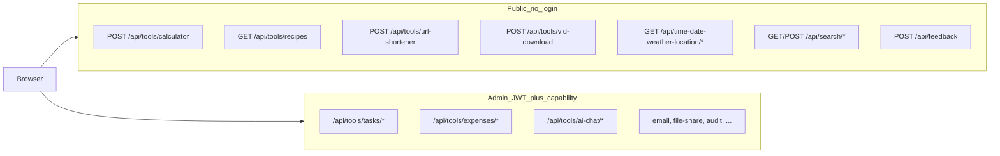

# API tools on your self-hosted site

All JSON routes live under **`/api`**. Platform tools mount at **`/api/tools/<slug>`** ([`server/app/routers/tools/__init__.py`](../server/app/routers/tools/__init__.py)). The canonical catalog is in [`server/app/platform/registry.py`](../server/app/platform/registry.py) and exposed at **`GET /api/platform/services`** (no auth required).

**Interactive docs:** Swagger UI at **`/api/docs`** only when `APP_ENV=development` ([`server/app/main.py`](../server/app/main.py)). In production, use the registry + this list or read [`server/app/openapi.py`](../server/app/openapi.py) tags locally.

**Auth model:** Admin tool routes require JWT (cookie or `Authorization: Bearer`) plus a capability like `expenses:read`. The bootstrap admin gets `platform:superuser` (all capabilities). New registered users start with **zero** tool permissions ([security.md](security.md)).



## Public tools (guests — no sign-in)

These appear on **`/tools`** in the UI ([`client/src/pages/ToolsPage.vue`](../client/src/pages/ToolsPage.vue)) and are rate-limited (typically 30 req/min per IP).

| Tool | UI route | Key API endpoints | Notes |
|------|----------|-------------------|-------|
| **Calculator** | `/calculator` | `POST /api/tools/calculator?a=&b=&op=` | Fully public; no capability gate ([`calculator.py`](../server/app/routers/tools/calculator.py)) |
| **Recipes** | `/recipes` | `GET /api/tools/recipes`, `GET /api/tools/recipes/tags`, `GET /api/tools/recipes/{id}` | Read-only public; writes need `recipes:write` |
| **URL shortener** | `/shortener` | `POST /api/tools/url-shortener` | Create is public (10/hour/IP); list/delete need `url-shortener:read/write`. Redirect: **`GET /s/{code}`** (not under `/api`) |
| **Video download** | `/vid-download` | `POST /api/tools/vid-download` | Public with strict limits (5/hour/IP, concurrency caps); YouTube hosts only |
| **Time / weather / location** | `/time-date-weather-location` | `GET /api/time-date-weather-location/config`, `/lookup/{city}`, `/time/{city}` | Lookup endpoints public; saved locations CRUD requires login ([`weather.py`](../server/app/routers/weather.py)) |

### Other public APIs (not on `/tools` page but usable)

| Feature | Endpoints |
|---------|-----------|
| **Portfolio resume** | `GET /api/resume` — static public resume JSON, with a client fallback mirror for offline rendering |
| **Keyword search** | `GET /api/search?q=...` (PUBLIC index only) |
| **Public AI search chat** | `GET /api/search/config`, `POST /api/search/chat` (SSE) — needs `AI_SEARCH_ENABLED=true` + `GEMINI_API_KEY` |
| **Feedback** | `POST /api/feedback` (5/5min) |
| **Donations config** | `GET /api/donations/config` — Stripe, PayPal, Patreon links |
| **Donations Checkout** | `POST /api/donations/checkout` — needs `STRIPE_SECRET_KEY` |
| **GitHub public repos** | `GET /api/github/repos` — needs `GITHUB_PUBLIC_USERNAME` |
| **Inbound webhooks** | `POST /api/webhooks/{slug}` — HMAC; see [integration-automation.md](integration-automation.md) |
| **Spotify widget** | `GET /api/spotify/now-playing` |
| **Health** | `GET /api/health`, `GET /api/ready` |
| **Service catalog** | `GET /api/platform/services` |
| **File download by code** | `GET /f/{code}` — public if you have the share code (upload requires admin) |
| **Auth (open registration)** | `POST /api/auth/register`, `/login`, `/forgot-password`, etc. |

## Admin tools (sign-in + permissions)

Available in **`/admin/tools/*`** after login. API prefix is always **`/api/tools/<slug>`** (feedback uses **`/api/feedback`**).

| Pillar | Tool | Capability keys | API prefix | Admin UI |
|--------|------|-----------------|------------|----------|
| Productivity | **Tasks** | `tasks:read`, `tasks:write`, `tasks:schedule` | `/api/tools/tasks` | `/admin/tools/tasks` |
| Productivity | **Email** | `email:write` | `/api/tools/email` | `/admin/tools/email` |
| Productivity | **Expenses** | `expenses:read`, `expenses:write` | `/api/tools/expenses` | `/admin/tools/expenses` |
| Content | **File share** | `file-share:read`, `file-share:write` | `/api/tools/file-share` | `/admin/tools/file-share` |
| Content | **URL shortener (manage)** | `url-shortener:read`, `url-shortener:write` | list/delete on same prefix | `/shortener` (UI adapts to permissions) |
| Content | **Recipes (write)** | `recipes:write` | POST/PUT/DELETE on `/api/tools/recipes` | `/recipes` |
| Utilities | **AI chat** | `ai-chat:read`, `ai-chat:write` | `/api/tools/ai-chat` | `/admin/tools/ai-chat` |
| Operations | **Feedback inbox** | `feedback:read`, `feedback:write` | `GET/PATCH /api/feedback` | `/admin/tools/feedback` |
| Operations | **Audit log** | `audit:read` | `/api/tools/audit` | `/admin/tools/audit` |

### AI: public vs admin

- **Public:** `POST /api/search/chat` — retrieval scoped to **PUBLIC** content (resume, public recipes).
- **Admin:** `POST /api/tools/ai-chat` — requires `ai-chat:write`; retrieval includes **PUBLIC + ADMIN** (tasks, expenses, feedback, etc.).

Both need LLM config; flags are independent:

- Public search: `AI_SEARCH_ENABLED` + `GEMINI_API_KEY`
- Admin chat: `AI_CHAT_ENABLED` + `GEMINI_API_KEY` (also hides `ai-chat` from catalog when disabled)

### How to call admin APIs programmatically

1. `POST /api/auth/login` with email/password → access token (JSON or HttpOnly cookie).
2. Swagger (dev): **Authorize** with `Bearer <token>`.
3. Script/curl: `Authorization: Bearer <token>` on `/api/tools/...` routes.

Permissions are assigned only via admin user management (`/api/admin/users` — requires superuser).

## Non-HTTP channels (same backend services)

These reuse the same service layer but are not REST “site API tools”:

- **Telegram todobot** — tasks, reminders, quick expenses (`/spend`, `/expenses`)
- **Celery worker/beat** — reminders, calendar sync, cleanup

## Discover what is enabled on your deploy

```bash
curl -s https://your-domain/api/platform/services | jq '.services[].slug'
```

Compare with [`.env.example`](../.env.example) for feature flags (`AI_SEARCH_ENABLED`, `AI_CHAT_ENABLED`, etc.).

## Inbound webhooks and automation

Signed webhooks (`POST /api/webhooks/{slug}`), Stripe Checkout, and script/n8n examples: [integration-automation.md](integration-automation.md).

## Related docs

- [Integration automation](integration-automation.md) — JWT scripts, webhooks, n8n, Stripe
- [Platform overview](platform.md) — channels, module-as-service pattern, observability
- [Security](security.md) — auth, rate limits, public-tool risks, AI scope
