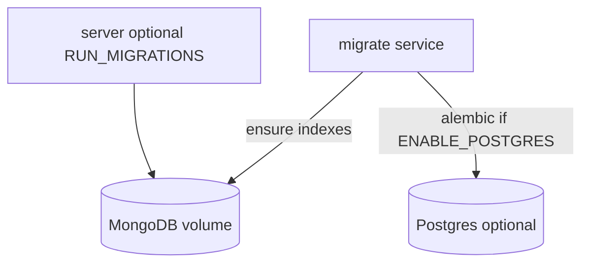

# Database

**MongoDB** is the primary application datastore. **PostgreSQL** is an optional secondary store for full-text search (`search_documents`) and audit events (`audit_events`). Schema changes for Postgres use **Alembic**; MongoDB uses versioned index scripts.

## Backends

| Backend | Role | Enable |
|---------|------|--------|
| MongoDB | Users, tasks, recipes, expenses, URLs, files, OAuth creds, etc. | `ENABLE_MONGODB=true` (default) |
| PostgreSQL | Optional FTS search + audit trail | `ENABLE_POSTGRES=true` + `--profile postgres` |
| SQLite | Local dev / pytest only | `APP_ENV=development` or `test` only |

## Connection

| Context | URL |
|---------|-----|
| Docker (Mongo) | `MONGODB_URL` in `.env` (host `mongodb`, port `27017`) |
| Host tools | `127.0.0.1:27017` |
| Docker (Postgres secondary) | `DATABASE_URL` with host `db`, port `5432` |
| Host Postgres tools | `localhost:5433` (dev compose maps `5433:5432`) |

## Bootstrap flow



1. **MongoDB** starts (default in compose).
2. **`migrate` service** runs [`server/scripts/db_init.sh`](../server/scripts/db_init.sh): wait for Mongo, `python -m app.db.mongo.migrate`, optionally Postgres Alembic.
3. **App services** start after `migrate` completes.

### Dev vs production

| Environment | Migrations |
|-------------|------------|
| **Dev** | `migrate` on stack start; `server` has `RUN_MIGRATIONS=true` |
| **Prod** | Only `migrate` service; `RUN_MIGRATIONS=false` on app containers |

## Make targets

| Command | Description |
|---------|-------------|
| `make dev-lite` | MongoDB + Redis + API (default) |
| `make dev-postgres` | Adds Postgres profile for search/audit secondary |
| `make db-init` | Run migrations (`docker compose run --rm migrate`) |
| `make migrate` | Alias for `db-init` |
| `make seed` | Idempotent admin + sample data (Mongo) |

First-time dev with seed:

```bash
RUN_SEED=true make db-init
```

## Migrating existing Postgres data

One-time copy from legacy Postgres to Mongo:

```bash
ENABLE_POSTGRES=true DATABASE_URL=postgresql+asyncpg://... \
  MONGODB_URL=mongodb://... \
  python server/scripts/migrate_postgres_to_mongo.py
```

Preserves integer `id` fields and seeds the Mongo counter collection.

## Tests

- Default: **mongomock-motor** in pytest (`server/tests/conftest.py`)
- Optional real Postgres integration: `POSTGRES_TEST_URL` + `pytest -m postgres`
- SQLite is blocked outside `APP_ENV=development|test`

## Architecture

- [`server/app/db/registry.py`](../server/app/db/registry.py) — injected connections + repositories
- [`server/app/db/init_service.py`](../server/app/db/init_service.py) — startup/shutdown orchestration
- [`server/app/db/repositories/`](../server/app/db/repositories/) — Mongo data access
- [`server/app/db/documents/`](../server/app/db/documents/) — Pydantic document models
