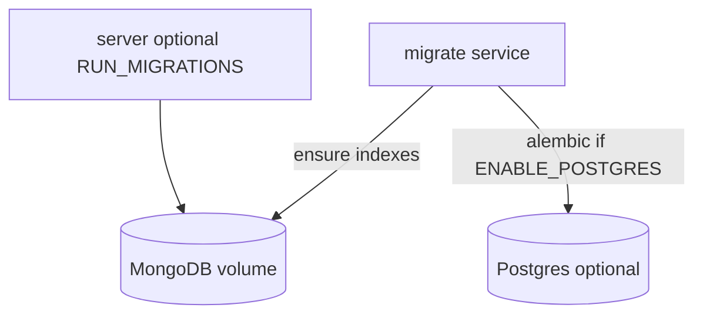

# Database

**MongoDB** is the primary application datastore. **PostgreSQL** is an optional secondary store for full-text search (`search_documents`) and audit events (`audit_events`). Schema changes for Postgres use **Alembic**; MongoDB uses versioned index scripts.

## Backends

| Backend | Role | Enable |
|---------|------|--------|
| MongoDB | Users, tasks, recipes, expenses, URLs, files, OAuth creds, etc. | `ENABLE_MONGODB=true` (default) |
| PostgreSQL | Optional FTS search + audit trail | `ENABLE_POSTGRES=true` + `--profile postgres` |
| SQLite | Local dev / pytest only | `APP_ENV=development` or `test` only |

## Connection

| Context | URL |
|---------|-----|
| Docker (Mongo) | `MONGODB_URL` in `.env` (host `mongodb`, port `27017`) |
| Host tools | `127.0.0.1:27017` |
| Docker (Postgres secondary) | `DATABASE_URL` with host `postgres` in dev compose or `db` in prod compose, port `5432` |
| Host Postgres tools | `localhost:5433` (dev compose maps `5433:5432`) |

## Bootstrap flow



1. **MongoDB** starts (default in compose).
2. **`migrate` service** runs [`server/scripts/db_init.sh`](../server/scripts/db_init.sh): wait for Mongo, `python -m app.db.mongo.migrate`, optionally Postgres Alembic.
3. **App services** start after `migrate` completes.

### Dev vs production

| Environment | Migrations |
|-------------|------------|
| **Dev** | `migrate` on stack start; set `RUN_MIGRATIONS=true` and `RUN_SEED=true` in `.env` |
| **Prod** | Only `migrate` service; set `RUN_MIGRATIONS=false` and `RUN_SEED=false` in `.env` |

## Make targets

| Command | Description |
|---------|-------------|
| `make dev-lite` | Default dev stack: MongoDB + Redis + API in Docker, with nginx for host Vite |
| `make dev-lite-client` | Host Vite client; pair with `make dev-lite` |
| `make dev` | Full Docker UI stack with nginx + containerized client |
| `make dev-postgres` | Adds Postgres profile for search/audit secondary |
| `make db-init` | Run migrations (`docker compose run --rm migrate`) |
| `make migrate` | Alias for `db-init` |
| `make seed` | Idempotent admin + sample data (Mongo) |
| `make seed-demo` | Bulk random demo data per platform tool (wipe + fill) |
| `make seed-demo-add` | Append demo data without wiping |
| `make seed-multicooker-recipes` | Fetch multicooker recipes from TheMealDB |

### Seed package layout

Entrypoints (backward-compatible module paths unchanged):

| Command | Module |
|---------|--------|
| `python -m app.db.seed` | Core dev seed — admin, sample recipes, expenses, tasks |
| `python -m app.db.seed_demo` | Demo bulk seed per tool |
| `python -m app.db.seed_multicooker_recipes` | External recipe import |

Implementation lives under [`server/app/db/seed/`](../server/app/db/seed/):

- `core/` — admin user, sample recipes (`data/sample_recipes.json`), expenses, tasks
- `demo/tools/` — per-platform-tool demo seeders (recipes, expenses, tasks, feedback, URLs)
- `builders/` — deterministic factories (`expense`, `task`, `demo`)
- `cli/` — argparse wrappers for demo and multicooker scripts

First-time dev with seed:

```bash
# Ensure RUN_SEED=true in .env, then:
make db-init
```

## Migrating existing Postgres data

One-time copy from legacy Postgres to Mongo:

```bash
ENABLE_POSTGRES=true DATABASE_URL=postgresql+asyncpg://... \
  MONGODB_URL=mongodb://... \
  python server/scripts/migrate_postgres_to_mongo.py
```

Preserves integer `id` fields and seeds the Mongo counter collection.

## Tests

- Default: **mongomock-motor** in pytest (`server/tests/conftest.py`)
- Optional real Postgres integration: `POSTGRES_TEST_URL` + `pytest -m postgres`
- SQLite is blocked outside `APP_ENV=development|test`

## Architecture

- [`server/app/db/registry.py`](../server/app/db/registry.py) — injected connections + repositories
- [`server/app/db/init_service.py`](../server/app/db/init_service.py) — startup/shutdown orchestration
- [`server/app/db/repositories/`](../server/app/db/repositories/) — Mongo data access
- [`server/app/db/documents/`](../server/app/db/documents/) — Pydantic document models

### Expense storage

Mongo collections: `expenses`, `expense_categories` (legacy `tool_*` names are renamed on migrate).

Postgres tables (optional secondary): `expenses`, `expense_categories` — see Alembic revision `o9p0q1r2s3t4`.

Domain types: `Expense`, `ExpenseCategory` in [`documents/expense.py`](../server/app/db/documents/expense.py). The expense field `tool_name` is the vendor/product label (e.g. Cursor, groceries), not a platform-tool slug.
