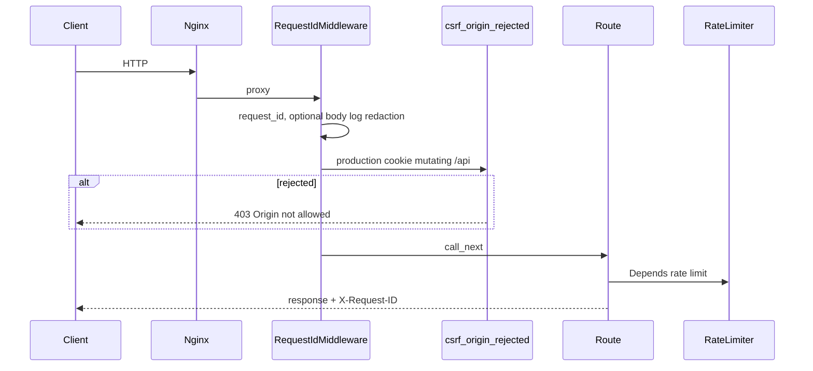

# Architecture

gLOrng is a **personal platform** where shared domain services power multiple channels.

## Traffic flow

```
Browser → Nginx (:80)
  ├── /              → Vue client (:3000)
  ├── /admin/*       → Vue client (admin SPA)
  ├── /api/*         → FastAPI (:8000) → MongoDB / Redis
  ├── /s/:code       → FastAPI → redirect
  └── /f/:code       → FastAPI → file download

FastAPI + Worker + Todobot share MongoDB and Redis.
PostgreSQL is optional for secondary FTS search and audit storage.
Elasticsearch is optional for search (`make dev-search`).
```

## Channels

| Channel | Entry | Uses |
|---------|-------|------|
| Public web | `/` | Resume, donations, feedback, public tools |
| Admin panel | `/admin` | Platform services via `/api/tools/*` |
| Telegram bot | `app.todobot.main` | Tasks, reminders, expense logging |
| Worker | `celery -A app.workers.celery_app worker` | Reminders, calendar sync, cleanup |
| Beat | `celery -A app.workers.celery_app beat` | Scheduled cron tasks |

## Data stores

| Store | Role |
|-------|------|
| **MongoDB** | Primary — users, tasks, recipes, expenses, files, etc. |
| **Redis** | Token blacklist, rate limits, response cache, Telegram FSM, email dispatch claims |
| **PostgreSQL** | Optional secondary — FTS search + audit (`--profile postgres`) |
| **Elasticsearch** | Optional search backend (`make dev-search`) |

See [Database](/operations/database) for bootstrap and migrations.

## Module-as-service pattern

```
Router (HTTP/auth) → Service (logic + audit) → MongoDB / Redis (+ optional PostgreSQL)
Channel adapter (Vue page, bot handler) → Service
```

- Registry: [`server/app/platform/registry.py`](../../server/app/platform/registry.py)
- Business logic: `server/app/services/`
- HTTP routers: `server/app/routers/tools/`

## Generated inventory

The live platform catalog and Compose service list are exported by `make docs-generate`:

- [Architecture inventory (generated)](/generated/architecture-inventory) — `PLATFORM_SERVICES` + `docker-compose.yml` services
- [API endpoints (generated)](/generated/api-endpoints) — OpenAPI path table
- [ADRs](/adr/) — architecture decision records

## Request hardening pipeline

Every HTTP request passes through `RequestIdMiddleware` before route handlers. Rate limits attach per-route via FastAPI `Depends`.



### Request ID middleware

[`server/app/core/middleware.py`](../../server/app/core/middleware.py):

1. Assigns `X-Request-ID` (from header or new UUID)
2. Optionally resolves `user_id` from access token for log correlation
3. Optionally logs sanitized request bodies when `LOG_REQUEST_BODIES=true`
4. Runs CSRF origin check (production only)
5. Logs request duration; adds `X-Request-ID` to the response

Context vars (`request_id`, `user_id`) feed structured logs and audit correlation.

### CSRF (production, cookie auth)

[`server/app/core/csrf.py`](../../server/app/core/csrf.py) — origin/referer allowlist, not double-submit tokens:

- Applies to mutating `/api` requests with an `access_token` cookie
- `/api/auth/refresh` with a `refresh_token` **cookie** also requires origin
- Body-only refresh (`{"refresh_token": "..."}`) is exempt
- Bearer-only clients skip CSRF

Details: [Security — CSRF](/reference/security#csrf-and-cors).

### Rate limiting

[`server/app/core/rate_limit.py`](../../server/app/core/rate_limit.py) — Redis fixed-window via atomic Lua (`INCR` + `EXPIRE` on first hit). Keys: `rl:{path}:{ip}`; IP from nginx `X-Real-IP`.

Abuse-sensitive routes **fail closed** (503) when Redis is down; general API traffic fails open.

### Bounded request bodies

Webhook and Stripe endpoints use [`read_request_body_bounded`](../../server/app/core/uploads.py) (1 MB cap) to reject oversized payloads before signature verification.

## Observability

Two complementary streams:

1. **Operational telemetry** — structured JSON logs (Loguru) + Sentry. Not queryable as audit.
2. **Audit trail** — `audit_events` with `security` and `domain` categories. Review at `/admin/tools/audit`.

## Related

- [Platform overview](/reference/platform)
- [Security](/reference/security)
- [API & tools](/reference/api-tools)
- [Architecture inventory (generated)](/generated/architecture-inventory)
