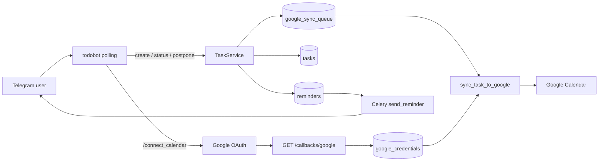

# Telegram + tasks + calendar sync

One-way pipeline: **Telegram (or admin) → Task (Postgres) → Google Calendar**. Calendar edits do not flow back. The join key everywhere is `telegram_user_id`.

## Telegram bot process

Entrypoint: [`server/app/todobot/main.py`](../../server/app/todobot/main.py) (`make dev-bot`).

- Needs `TELEGRAM_BOT_TO_DO_TOKEN`
- Aiogram **polling** (not webhook)
- FSM state in Redis (`todobot_fsm` prefix)
- Injects DB via `MongoRegistryMiddleware` (name is historical; tasks live in Postgres)
- On startup: recover unsent reminders missing `job_id` via `schedule_reminder`
- Bot commands: `/new`, `/tasks`, `/connect_calendar`, `/help`

Routers: `start`, `task_create`, `task_manage`, `reminder`, `calendar`.

## Who can use the bot

[`AllowedUserMiddleware`](../../server/app/todobot/middlewares/auth.py) drops **Message** events when `TELEGRAM_ALLOWED_USER_ID` is set and `from_user.id` does not match. Single-owner personal bot.

Admin API create falls back to the same id: `telegram_user_id or TELEGRAM_ALLOWED_USER_ID` in [`tasks_admin.py`](../../server/app/routers/tools/tasks_admin.py).

## Identity link: `telegram_user_id`

| Store | Role of `telegram_user_id` |
|-------|----------------------------|
| `tasks` | Owner of the task |
| `google_credentials` | Unique Google OAuth binding |
| OAuth Redis state | Maps OAuth `state` → Telegram user until callback |
| Admin create | Explicit or default allowed user |

Sync lookup: `sync_task_to_google` loads credentials with `get_google_for_telegram_user(task.telegram_user_id)`. No creds → queue item fails with `"No Google credentials"`.

## Connect Google from Telegram

1. Menu **Calendar** or `/connect_calendar` → [`cmd_connect_calendar`](../../server/app/todobot/handlers/calendar.py)
2. Stores OAuth state in Redis keyed to `message.from_user.id`
3. User opens Google consent (`calendar` scope, offline + consent)
4. [`GET /callbacks/google`](../../server/app/routers/callbacks.py) exchanges code, encrypts refresh token, upserts `google_credentials`
5. Sends Telegram “connected” DM; `/start` welcome shows Calendar connected/not

## Task creation from Telegram

[`start.py`](../../server/app/todobot/handlers/start.py) menu:

- **Quick task** → AI intake (`_start_ai_intake`)
- **Guided task** → step FSM (`_start_guided`)
- `/new` → same create flow in [`task_create.py`](../../server/app/todobot/handlers/task_create.py)

Confirm path:

- With intake: `TaskIntakeService.confirm_intake(..., telegram_user_id=callback.from_user.id)` → `create_with_sync`
- Guided: `create_with_sync(..., telegram_user_id=callback.from_user.id, ...)`

`create_with_sync` then:

1. Insert task for that Telegram user
2. Schedule Telegram reminders (always at-start + optional early)
3. Enqueue Calendar `CREATE` and kick in-process drain

Welcome (`/start`) lists pending tasks for that user and calendar link status.

Other create entry points (same service path): admin `POST /api/tools/tasks` and intake confirm from the service layer.

## Telegram mutations that touch Calendar

| Telegram action | Handler | TaskService | Calendar |
|-----------------|---------|-------------|----------|
| Mark complete / not / postponed | `task_manage` `status:` | `change_status` | `UPDATE` if `google_event_id` |
| Reminder → Complete | `reminder` `raction:…:complete` | `change_status` | same |
| Reminder → Postpone | `reminder` + FSM | `reschedule_task` | `UPDATE` if event id |
| Reminder → Snooze | `reminder` `raction:…:snooze` | new reminder only | **no** immediate Calendar sync (popups come from unsent reminders on next UPDATE/CREATE) |

## Telegram reminders (parallel to Calendar popups)

- Reminder rows scheduled via Celery (`schedule_reminder`)
- Worker [`send_reminder`](../../server/app/workers/tasks.py) DMs the bot with `reminder_actions` keyboard
- Calendar event popups are derived from the **same** unsent reminder offsets when syncing (`_reminder_minutes_for_task` in [`calendar.py`](../../server/app/services/calendar.py))

So Telegram ping and Google popup are aligned by design, but delivered by different channels.

## Sync queue + drain

Outbox: `google_sync_queue` (`create|update|delete`).

Drain path [`process_sync_queue`](../../server/app/workers/tasks.py):

1. Pull up to 10 due pending rows
2. Call [`sync_task_to_google`](../../server/app/services/calendar.py)
3. On success → `COMPLETED`; skip reason (missing task/creds) → `FAILED`; exception → backoff `[60, 300, 900, 3600]`s, permanent fail after 5 attempts

Two ways drain runs:

- **Immediate**: `enqueue_calendar_sync` → `_kick_calendar_sync_drain` (in-process `await process_sync_queue()` — works without a Celery worker; see [Development](/guide/development))
- **Periodic**: Celery beat `process-sync-queue` every **2 minutes** when worker is running and eager is off

Admin ops ([`tasks_admin.py`](../../server/app/routers/tools/tasks_admin.py) + Vue [`TasksSyncPanel.vue`](../../client/src/components/tasks/TasksSyncPanel.vue)):

- `GET /api/tools/tasks/sync-queue` — list queue
- `POST /api/tools/tasks/sync-queue/process` — arm pending + kick drain (“Sync now”)
- `POST /api/tools/tasks/{id}/retry-sync` — reset failed rows for a task, then kick

What gets written to Google: event `summary=title`, start=end=`scheduled_at` (UTC), description/location, custom popup reminders (including 0-minute). `CREATE` stores `google_event_id` on the task.

`DELETE` exists in the calendar service but is not enqueued from Telegram/admin production paths today.

## Mental model

- **Telegram user id** = personal namespace for tasks + Google auth
- **Todobot** = primary UX for create/manage/remind + OAuth entry
- **Tasks** = source of truth
- **google_sync_queue** = durable outbox Task → Calendar
- **Celery** = Telegram reminder delivery + periodic sync/overdue cleanup

## Related

- [Architecture](/guide/architecture)
- [Development — Telegram todobot](/guide/development#telegram-todobot)
- [Platform overview](/reference/platform)
- [API & tools](/reference/api-tools)
- [Configuration — Telegram / Google](/reference/configuration)
