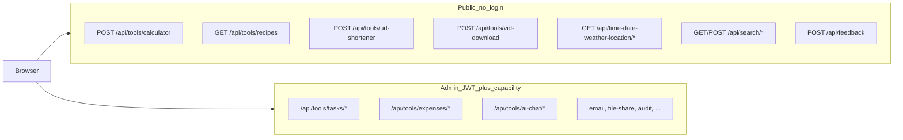

# API & tools

All JSON routes live under **`/api`**. Platform tools mount at **`/api/tools/<slug>`** ([`server/app/routers/tools/__init__.py`](../../server/app/routers/tools/__init__.py)). The canonical catalog is in [`server/app/platform/registry.py`](../../server/app/platform/registry.py) and exposed at **`GET /api/platform/services`** (no auth required).

**Interactive docs:** Swagger UI at **`/api/docs`** only when `APP_ENV=development` ([`server/app/main.py`](../../server/app/main.py)). **Static OpenAPI:** download [openapi.json](/openapi.json) (from `make docs-generate`). **Endpoint table:** [API endpoints (generated)](/generated/api-endpoints). **Postman:** [Postman guide](/reference/postman).

**Auth model:** Admin tool routes require JWT (cookie or `Authorization: Bearer`) plus a capability like `expenses:read`. The bootstrap admin gets `platform:superuser` (all capabilities). New registered users start with **zero** tool permissions ([Security](/reference/security)).



## Catalogs (generated)

Hand-maintained endpoint lists drift; use the generators instead:

| Resource | Link |
|----------|------|
| Full OpenAPI path table | [API endpoints (generated)](/generated/api-endpoints) |
| Platform services + Compose | [Architecture inventory (generated)](/generated/architecture-inventory) |
| Raw OpenAPI schema | [openapi.json](/openapi.json) |

Regenerate after router or registry changes: `make docs-generate`.

## Public vs admin (summary)

- **Public tools** appear on **`/tools`** ([`ToolsPage.vue`](../../client/src/pages/ToolsPage.vue)) and are rate-limited. Capability gates still apply on write paths where noted in OpenAPI summaries.
- **Admin tools** live under **`/admin/tools/*`** after login. API prefix is usually **`/api/tools/<slug>`** (feedback uses **`/api/feedback`**).
- **AI chat** requires `platform:superuser` plus `AI_CHAT_ENABLED` + `GROQ_API_KEY`.

See the [architecture inventory](/generated/architecture-inventory) for slug, capability, and route columns.

### How to call admin APIs programmatically

1. `POST /api/auth/login` with email/password → access token (JSON or HttpOnly cookie).
2. Swagger (dev): **Authorize** with `Bearer <token>`.
3. Script/curl: `Authorization: Bearer <token>` on `/api/tools/...` routes.

Permissions are assigned only via admin user management (`/api/admin/users` — requires superuser).

## Non-HTTP channels (same backend services)

These reuse the same service layer but are not REST “site API tools”:

- **Telegram todobot** — tasks, reminders, quick expenses (`/spend`, `/expenses`)
- **Celery worker/beat** — reminders, calendar sync, cleanup

## Discover what is enabled on your deploy

```bash
curl -s https://your-domain/api/platform/services | jq '.services[].slug'
```

Compare with [Configuration](/reference/configuration) for feature flags (`AI_SEARCH_ENABLED`, `AI_CHAT_ENABLED`, etc.).

## Inbound webhooks and automation

Signed webhooks (`POST /api/webhooks/{slug}`), Stripe Checkout, and script/n8n examples: [Integration automation](/reference/integration-automation).

## Related docs

- [Integration automation](/reference/integration-automation) — JWT scripts, webhooks, n8n, Stripe
- [Platform overview](/reference/platform) — channels, module-as-service pattern, observability
- [Security](/reference/security) — auth, rate limits, public-tool risks, AI scope
- [ADR 0002](/adr/0002-openapi-docs-development-only) — why Swagger is development-only
