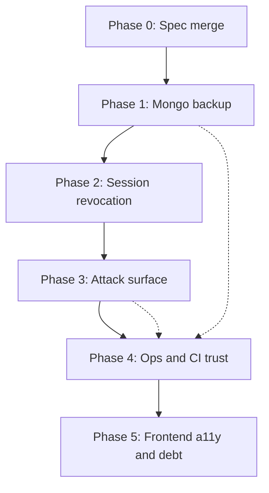

# Spec + Plan: Platform Hardening & Quality Improvements

## Objective

Close the highest-impact gaps found in the Jul 2026 repo review: primary-data backups, session revocation, SSRF/webhook/XML hardening, ops/CI trust, and a small set of frontend maintainability fixes.

Success looks like: Mongo can be restored from backup; compromised or rotated credentials invalidate outstanding sessions; outbound URL fetches and public webhooks resist abuse; CI/docs/Dependabot match reality; admin UI debt is reduced without a redesign.

## Assumptions

1. MongoDB remains the primary datastore; Postgres stays optional secondary.
2. Cookie + JWT auth stays; we extend revocation rather than replace the auth model.
3. Work ships as stacked thin PRs (one theme each), not one mega-PR.
4. New dependencies need approval (`defusedxml` for XML hardening is the only likely add).
5. Cloudflare origin IP allowlisting may need host/DNS access outside this repo — document + nginx/app hooks first; infra firewall is a follow-up if not controllable here.
6. Nice-to-have items (httpx pooling, dead-link CI, admin UI splits beyond a11y) are deferred unless a phase finishes early.

→ Correct these before implementation if wrong.

## Out of scope (this program)

- Full frontend redesign or new design-system components beyond a11y fixes
- Migrating secrets to a cloud vault product (support env/file secrets only)
- Rewriting compose topology into fewer files
- Performance rewrite of search/reindex beyond cursor/batch fixes already listed
- Expanding Playwright to full admin coverage (only align docs or add one smoke if cheap)

## Tech / commands

| Check | Command |
|-------|---------|
| Backend lint | `cd server && UV_PROJECT_ENVIRONMENT=/tmp/glorng-server-venv uv run ruff check .` |
| Backend tests | `cd server && GLORNG_ENV_FILE=$PWD/tests/.env.test UV_PROJECT_ENVIRONMENT=/tmp/glorng-server-venv uv run pytest -v <paths>` |
| Frontend lint/test | `cd client && npm run lint && npm run test` |
| Docs build | `make docs-build` |
| Backup dry-run | `make backup` (needs compose + `.env`) |

## Boundaries

- **Always:** targeted tests for each slice; update `docs/operations/*` or `docs/reference/*` when behavior changes; no secrets in git
- **Ask first:** new dependencies; Dependabot/CI workflow changes that alter merge gates; production compose hardening that could break deploys
- **Never:** delete existing backup scripts without replacement; weaken CSRF/rate-limit fail-closed behavior; commit `.env`

## Success criteria

- [ ] `make backup` produces a Mongo dump + restore path documented and verified once in CI or a manual drill note
- [ ] Password reset/change, email change, and account delete invalidate other-device access/refresh tokens
- [ ] URL safety rejects hosts that resolve to private/link-local/reserved addresses; redirect targets re-checked
- [ ] Stripe donation webhook is fail-closed rate-limited
- [ ] XML extraction rejects DTD/entity expansion (parser-level or `defusedxml`)
- [ ] Request-body logging skips multipart/binary and is capped; production cannot silently enable unbounded body logs
- [ ] Testing docs match what nightly/pre-release actually run (or those jobs gain the missing smokes)
- [ ] Dependabot covers `/docs`, GitHub Actions, and Docker where practical
- [ ] Critical dropdown/menu triggers have accessible names; nested interactive card pattern fixed where called out
- [ ] Each phase PR links back to the phase section below

---

## Plan overview



| Phase | Theme | Depends on | Risk |
|-------|--------|------------|------|
| 0 | Land this plan | — | None |
| 1 | Mongo backup/restore | 0 | Ops script mistakes; verify restore before declaring done |
| 2 | Session revocation | 0 | Auth regressions; needs careful JWT claim migration |
| 3 | SSRF, Stripe RL, XML, body-log | 0 | False-positive URL blocks; keep tests tight |
| 4 | Secrets posture, Dependabot, CI/docs, prod hardening | 1 helpful for backup docs | Compose hardening can break prod — ship behind review |
| 5 | Frontend a11y + small splits | 0 | UI regressions; keep PRs small |

Phases 3 and 5 can start in parallel with 2 after Phase 1 if staffing allows. Phase 4 should wait until backup docs exist so CI/docs updates stay coherent.

---

## Phase 1 — Mongo backup & restore

### Goal

Primary datastore is backed up and restorable with the same retention/notify path as Postgres.

### Approach

1. Extend `scripts/db_maintenance.sh` with `mongodump` against the `mongodb` service (auth from `.env`).
2. Add `mongorestore` path (script target or documented one-liner) and verify dump non-empty.
3. Update `docs/operations/backup-restore.md` asset table + restore section.
4. Optional: `make backup` / cron already call the script — keep that entrypoint.

### Tasks

- [ ] Task: Add Mongo dump + rotation to `db_maintenance.sh`
  - Acceptance: Daily run writes `backups/mongodb/*` and `*_latest` symlink; retention matches other assets
  - Verify: Script dry-run or unit-style shell check; dump file exists and is non-trivial size
  - Files: `scripts/db_maintenance.sh`, maybe `Makefile`, `.env.example`

- [ ] Task: Document restore + update ops docs
  - Acceptance: Backup-restore doc lists Mongo; restore steps work on a throwaway DB
  - Verify: Manual restore drill noted in PR; `make docs-build`
  - Files: `docs/operations/backup-restore.md`, `docs/operations/database.md` if needed

### Checkpoint

Operator can lose the Mongo volume and recover application data from backup.

---

## Phase 2 — Session revocation

### Goal

Security-sensitive account events invalidate outstanding access/refresh tokens on all devices.

### Approach

1. Add `session_version` (int) on the user document; default `0` for existing users.
2. Include `sv` (or `session_version`) in access + refresh JWT payloads at issue time.
3. In `_resolve_user_from_token`, reject tokens whose `sv` ≠ current user value.
4. Bump `session_version` on: password reset, password change, email change, account delete (delete may only need blacklist + bump if soft-delete; hard-delete already removes user — still blacklist current tokens).
5. Keep Redis `jti` blacklist for logout/reuse detection; version is the coarse revoke.

### Tasks

- [ ] Task: User field + token issue/validate
  - Acceptance: Tokens without matching `sv` get 401; old tokens without claim treated as revoked (or migrate with default `0` only for one release — prefer fail closed: missing `sv` ⇒ invalid)
  - Verify: `pytest` auth/account tests for issue + reject
  - Files: `server/app/db/documents/user.py`, `server/app/core/security.py`, `server/app/core/deps.py`, repositories as needed

- [ ] Task: Bump on account security events
  - Acceptance: After reset/change-password/email-change, prior refresh/access from another session fails
  - Verify: Tests in `server/tests/test_auth.py` / account tests
  - Files: `server/app/services/auth.py`, `server/app/routers/account.py`, `server/app/services/account.py`

- [ ] Task: Docs note
  - Acceptance: Security reference mentions global session revoke on credential change
  - Verify: `make docs-build`
  - Files: `docs/reference/security.md`

### Checkpoint

Changing password on device A logs out device B on next API call.

---

## Phase 3 — Attack surface hardening

### Goal

Tighten SSRF, webhook abuse, XML bombs, and accidental body logging.

### Tasks

- [ ] Task: DNS-aware URL safety + redirect re-check
  - Acceptance: Hostname resolving to `10/8`, `127/8`, link-local, etc. rejected; news/metadata fetch re-validates redirect URLs
  - Verify: `server/tests/test_url_safety.py` (+ news fetch tests if present)
  - Files: `server/app/core/url_safety.py`, `server/app/services/news.py`, tests

- [ ] Task: Rate-limit Stripe webhook
  - Acceptance: Fail-closed limiter on `POST /api/donations/webhook` like generic webhooks
  - Verify: Rate-limit test or donations webhook test
  - Files: `server/app/routers/donations.py`, tests

- [ ] Task: Harden XML extraction
  - Acceptance: DTD/entity payloads rejected; no `# noqa: S314` on unsafe parser
  - Verify: `server/tests/test_data_extractor.py` cases for entity expansion
  - Files: `server/app/core/xml_security.py`, `server/app/core/data_extractor/handlers/xml_handler.py`, `server/pyproject.toml` if adding `defusedxml`
  - Ask first: dependency add

- [ ] Task: Cap / skip request-body logging
  - Acceptance: Middleware skips multipart/octet-stream; respects Content-Length + hard cap; production validator warns or forbids `LOG_REQUEST_BODIES=true`
  - Verify: Middleware/settings tests
  - Files: `server/app/core/middleware.py`, `server/app/settings.py`, `.env.example`

### Checkpoint

Public fetchers and webhooks have abuse controls; body logging cannot OOM the API in prod by misconfig.

---

## Phase 4 — Ops, CI, and automation trust

### Goal

Docs match automation; dependency bots cover the real surface; prod posture improves without breaking deploys.

### Tasks

- [ ] Task: Align testing docs with workflows (or add missing smokes)
  - Acceptance: `docs/reference/testing.md` accurately describes nightly/pre-release; prefer adding one nginx health smoke and documenting the rest as future if cost is high
  - Verify: Doc review + workflow dry-read; optional workflow run
  - Files: `docs/reference/testing.md`, `.github/workflows/nightly.yml`, `.github/workflows/pre-release.yml`

- [ ] Task: Expand Dependabot
  - Acceptance: Entries for `/docs` npm, `github-actions`, and Docker ecosystems used by the repo
  - Verify: `dependabot.yml` schema valid
  - Files: `.github/dependabot.yml`, note in `docs/reference/security.md` if needed

- [ ] Task: Production compose hardening (minimal safe set)
  - Acceptance: Log rotation + `no-new-privileges` (and `read_only`/`tmpfs` only where paths are known writable); documented caveats
  - Verify: `docker compose -f docker-compose.prod.yml config` succeeds; ask before aggressive `cap_drop`
  - Files: `docker-compose.prod.yml`, `docs/operations/deployment.md`

- [ ] Task: Settings secret sources (incremental)
  - Acceptance: Settings can read process env (and optional file secrets) without requiring a mounted mega-`.env` for every field; dotenv remains supported for local/dev
  - Verify: Settings unit tests for env override
  - Files: `server/app/settings.py`, `.env.example` or `.env.production.example`, docs

### Checkpoint

An outsider reading testing/security docs is not misled; Dependabot PRs appear for Actions/docs/Docker; prod compose is slightly harder to abuse.

---

## Phase 5 — Frontend a11y & small debt

### Goal

Fix the highest-cost accessibility issues and one maintainability hotspot without a redesign.

### Tasks

- [ ] Task: Accessible dropdown/menu triggers + focus
  - Acceptance: Icon-only triggers have accessible names; menu/popover focus moves appropriately for `BaseDropdownMenu` / `AdminFilterDropdown`
  - Verify: Component tests and/or axe on one admin page in e2e
  - Files: `client/src/components/ui/BaseDropdownMenu.vue`, `client/src/components/admin/AdminFilterDropdown.vue`, tests

- [ ] Task: Fix nested interactive `RecipeCard` pattern
  - Acceptance: Card navigation and inner tag controls are not nested buttons
  - Verify: Component test or manual keyboard check
  - Files: `client/src/components/recipes/RecipeCard.vue`

- [ ] Task (optional): Extract one oversized admin tool composable
  - Acceptance: One of `DataExtractTool` / `NewsAdminPage` / `AdminUsersPage` loses ~150+ lines to a composable without behavior change
  - Verify: Existing unit tests + smoke; no visual redesign
  - Files: chosen page + new composable

- [ ] Task (optional): Remove dead `TokenResponse` type
  - Acceptance: Unused export gone; cookie-auth types remain accurate
  - Verify: `npm run build:check`
  - Files: `client/src/types/index.ts`

### Checkpoint

Keyboard/AT users can operate admin menus; one admin page is easier to change.

---

## Deferred backlog (explicit)

Do not pull into phases above unless idle:

| Item | Why deferred |
|------|----------------|
| Cursor/batch replace all `limit=10_000` | Perf, not security; do after Phase 3 if needed |
| Compound Mongo indexes `(created_by, created_at)` | Easy win — can piggyback on Phase 1 or 3 if tiny |
| Atomic `$inc` click/download counters | Correctness under concurrency; low urgency |
| Shared `httpx.AsyncClient` | Perf nicety |
| Type-aware ESLint / typecheck tests | Tooling; separate PR |
| VitePress `ignoreDeadLinks: false` | Needs link cleanup pass first |
| Cloudflare real visitor IP + origin allowlist | Partly outside repo; track in ops issue |
| Full CodeQL/Trivy/SBOM | Security CI expansion; after Dependabot |

---

## PR stacking convention

Each phase → branch `cursor/<phase-kebab>-e7cb` (or agent suffix), draft PR, link this doc:

```text
Implements docs/specs/platform-hardening.md — Phase N
```

Prefer ~100–300 LOC intentional change per PR; split Phase 3 into SSRF / Stripe+XML / body-log if needed.

---

## Open questions

1. For JWT migration: fail closed on missing `session_version` (forces re-login for everyone on deploy) — **recommended** — or accept `sv=0` default for one release?
2. Is `defusedxml` approved, or prefer rejecting DTD with stdlib-only checks?
3. Should Phase 4 change Settings to read process env now, or only add `.env.production.example` + document Docker secrets later?
4. Which single admin page should Phase 5 optional split target first?

---

## Verification story (program-level)

| Phase | Minimum verification |
|-------|----------------------|
| 1 | Backup artifact exists; restore drill documented |
| 2 | Targeted auth/account pytest |
| 3 | url_safety + data_extractor + donations/rate-limit pytest |
| 4 | Workflow/YAML review; `compose config`; docs build |
| 5 | Client lint/test; optional axe e2e on one admin route |
