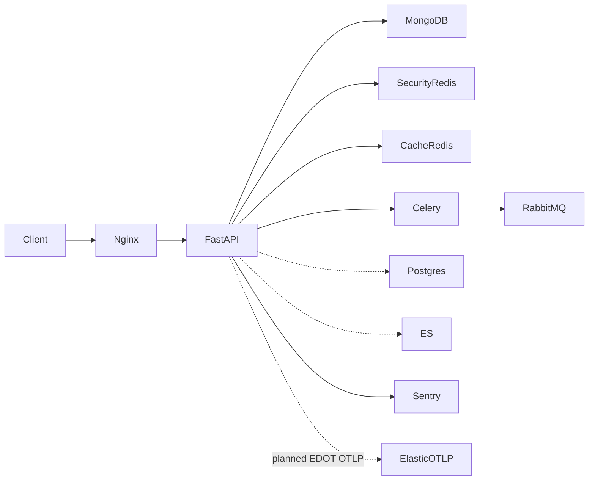

# Backend architecture review + implementation plan

Status: **record only** — leave the codebase as-is; do not implement these phases unless explicitly requested later.

## Executive summary

The backend is a mature personal-platform monolith: FastAPI → services → Motor repositories, MongoDB primary, dual Redis (security vs cache), optional Postgres/ES secondaries, Celery for background work, capability-based authz, Sentry + Loguru JSON + request IDs. Layering and security posture are strong for current scale.

**Critical gaps for growth:** no OpenTelemetry/metrics (Sentry alone), in-process concurrency limits that break under prod `--workers 4`, and operational complexity from optional dual-write surfaces (Postgres/ES). **Appwrite is not a fit** — there is zero Appwrite usage; migrating to TablesDB would discard a working Mongo/repo stack for no gain. Do not implement Appwrite.

**Maturity:** production-capable for a personal portfolio; observability and multi-worker correctness are the main blockers before treating traffic/abuse as first-class.

---

## Review findings (condensed)

### Strengths

- Clear router / service / repository split (`app/main.py`, `app/db/repositories/`)
- Capability registry + JWT cookie/Bearer, CSRF for cookie mutating APIs, bcrypt off event loop
- Dual Redis roles, Redis rate limits, `/api/health` + `/api/ready`
- Pagination convention (`per_page` ≤ 100), Mongo index ensure at boot
- Sentry on API; Loguru JSON + `X-Request-ID`

### Concerns by severity

| Severity | Finding |
|----------|---------|
| HIGH | No OTel/EDOT/Prometheus — no RED metrics, no W3C traces across API↔Celery↔Mongo |
| HIGH | Vid-download slots are process-local (`app/routers/tools/viddownload.py`) — under repo `docker-compose.prod.yml` `--workers 4`, global limit is 8 |
| MEDIUM | Eager Celery default in lite hides missing worker; heavy jobs can block the API process |
| MEDIUM | Shared Redis if `REDIS_CACHE_URL` unset — LRU can fight security keys |
| MEDIUM | Dual persistence (Mongo + optional Postgres dual-write + ES) increases drift cost |
| LOW | Unpaginated category list `limit=500`; recipe search fan-in at 500 then paginate |
| LOW | Mongo schema = boot-time ensure, weak for destructive/rolling migrations |
| OUT | Appwrite — do not adopt |

### Security checklist (current posture)

- Authn JWT + blacklist, authz capabilities, rate limits, CSRF, production secret validators, password policy, Fernet for OAuth secrets at rest: good for current threat model
- Still watch: public heavy endpoints (vid-download, weather upstream), file/URL tools, webhook HMAC surfaces

### Technology stack assessment

- FastAPI + Motor + Celery + Redis is appropriate; keep it
- Sentry stays for errors; EDOT would add traces/metrics to Elastic (or any OTLP endpoint)
- Do **not** add classic `elastic-apm` alongside EDOT
- Do **not** introduce Appwrite Python SDK

### Scalability roadmap (triggers)

1. **Now / pre-prod:** EDOT opt-in + Redis concurrency for vid-download + enforce dual Redis in prod docs
2. **Abuse or public traffic:** tighten public rate limits; consider CDN/WAF already in devops checklist
3. **Multi-user collaboration:** resource ownership / roles beyond flat permission lists
4. **High log volume:** ship logs off Mongo to ES/Loki; retention policies
5. **Only if product pivots:** simplify secondaries (drop unused Postgres dual-write) before adding new stores

---

## Implementation plan (phased) — not started

Default assumption: personal / low-traffic portfolio, Elastic OTLP endpoint available when enabling EDOT (same opt-in pattern as Sentry). No Appwrite work.

### Phase 1 — EDOT OpenTelemetry (opt-in)

Follow EDOT zero-code instrumentation (no in-app `TracerProvider`):

1. **Deps** — add `elastic-opentelemetry` to `pyproject.toml`; run `edot-bootstrap --action=install` in `Dockerfile` builder/prod stages so auto-instrumentation packages match installed libs (FastAPI, httpx, Redis, Celery, Motor/ES as detected).
2. **Entrypoints** — wrap process starts with `opentelemetry-instrument`:
   - Prod/dev uvicorn CMD in Dockerfile and compose overrides
   - Celery worker/beat commands in compose / docs
   - Host `make` targets that start API/worker similarly when OTEL is enabled (or document that wrap is only for Docker prod)
3. **Env contract** (document in repo `.env.example` + `docs/reference/configuration.md`):
   - `OTEL_SERVICE_NAME` (e.g. `glorng-api` / `glorng-worker`)
   - `OTEL_EXPORTER_OTLP_ENDPOINT` (managed OTLP or EDOT Collector — **not** APM Server `:8200`)
   - `OTEL_EXPORTER_OTLP_HEADERS` (`Authorization=ApiKey …` or Bearer)
   - Do **not** set `OTEL_TRACES_EXPORTER` / `METRICS` / `LOGS` exporters (EDOT defaults)
   - Gate: only wrap with `opentelemetry-instrument` when endpoint is set (shell wrapper or entrypoint branch), so local lite stays zero-overhead
4. **Coexistence** — keep Sentry for errors; EDOT for traces/metrics. Document that classic Elastic APM agent must never be added. Optionally set `OTEL_RESOURCE_ATTRIBUTES` with `service.version` aligned to `SERVER_SENTRY_RELEASE`.
5. **Verify** — manual checklist in devops docs (collector or Elastic serverless, hit `/api/health`, confirm spans). No mandatory full suite.

### Phase 2 — Multi-worker concurrency (vid-download)

Replace in-process `_active_downloads` / `_ip_active_downloads` in `app/routers/tools/viddownload.py` with **Redis security-client** semaphores (INCR/DECR with TTL safety, or Lua acquire/release), keyed like existing rate-limit keys in `app/core/redis_keys.py`.

- Preserve limits: global 2, per-IP 1
- Fail closed on Redis errors for this path (same spirit as auth rate limits) so workers cannot stampede when Redis is down
- Small unit tests with FakeRedis for acquire/release and limit exceeded

### Phase 3 — Performance / ops hardening (small)

1. **Dual Redis prod invariant** — document + optional settings warning when `APP_ENV` is staging/production and `REDIS_CACHE_URL` is empty or equals `REDIS_URL` (`app/settings.py`, deployment docs).
2. **Bound already-known high caps** — keep category `limit=500` if intentional; leave recipe search 500 as acceptable for personal data unless product asks otherwise.
3. **Eager Celery footgun** — one-line callout in `docs/guide/development.md`: scheduled jobs need `make dev-worker` + `CELERY_TASK_ALWAYS_EAGER=false`.
4. **Update** `docs/operations/devops-checklist.md`: move Prometheus/Grafana from “deferred forever” to “covered by EDOT OTLP when configured”; note Celery OTel parity.

### Explicitly deferred

- Appwrite migration or hybrid Appwrite auth
- Code-level OTel SDK / custom spans (only if auto-instrumentation gaps appear later)
- Replacing Loguru with structlog
- Versioned Mongo migration framework
- Removing Postgres dual-write / SQLAlchemy legacy models
- Full RBAC / multi-tenant redesign
- WeasyPrint PDF shared cache across workers (ponytail ceiling remains OK)

---

## Prioritized next steps (when implementing)

| Priority | Item | Effort |
|----------|------|--------|
| Must | Phase 1 EDOT opt-in wiring | ~0.5–1 day |
| Must | Phase 2 Redis vid-download slots | ~2–4 hours |
| Should | Phase 3 docs + dual-Redis warning | ~1–2 hours |
| Nice | Recipe/category cap review | optional later |

### Verification after implementation

- `uv run ruff check` on touched paths
- Focused pytest for Redis concurrency helper + existing sentry/settings tests if settings change
- Manual: enable OTEL env against a collector, confirm one HTTP span; hit vid-download under 2 workers and confirm global cap of 2 across processes
